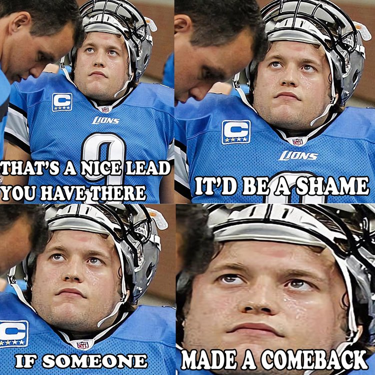

```{r, "setup", include=FALSE}
library(data.table)
library(na.tools)
library(ggrepel)
library(kableExtra)
source('../r-exts/nfl_themes.R')
source('../r-exts/nflscrapr_extra.R')
```
Last updated: `r Sys.time()`

##### All data from [nflscrapR](https://github.com/maksimhorowitz/nflscrapR)
<br>
<br>

The 2019 season is almost upon us, but this analysis is based on one of those questions you spend half the offseason arguing over in a group-chat because there is no real football to be had (RIP the AAF). Which QB is the most "clutch"?

### What is "clutch"?

**Clutch**. The term is used a lot, but what does it really mean? Is it at all quantifiable? Or is it something altogether more intangible, something *je ne sais quoi*, an *"I know it when I see it"*?

A couple of descriptions gathered from friends:

> Who do you want leading your drive with 2 minutes on the clock in the Superbowl down 5

> Makes big plays in big moments, not just the winning moments but keeping you in the game

There is a fairly obvious caveat that comes with these notions of 'clutchness'. If you are that good then you are unlikely to find yourself trailing, or even only narrowly leading, late in the game. Essentially, is being clutch only important if you aren't that good to start with? Or if you are really good, and still in a close game, it could be because you are up against a particularly good defence. 

On that basis perhaps it's a fool's errand to try and quantify it, but where's the fun in that.

With all this in mind I decided to define it as performance in the fourth quarter when the game was in the balance.
I defined a game as 'in the balance' using the following rules:
* Up by 8 or less
* Down by 24 or less with more than 10 minutes remaining
* Down by 16 or less with more than 5 minutes remaining
* Down by 8 or less

This is far from perfect, but this is a fun exercise so it will do.

### The Regular Season

```{r, "data-prep-reg"} 
# Get the play-by-play data
reg_pbp <- fread('../data/2009_2018_reg_pbp_all.csv')
reg_pbp <- filt_run_pass(reg_pbp)

#Filter to Q4 play in close situations
q4_qb <- reg_pbp[
  qtr==4 & pass==1 & !is.na(passer_player_name) & 
    passer_player_name != '' &
    score_differential <= 8 &
    ((score_differential >= -24 & game_seconds_remaining > 600) |
     (score_differential >= -16 & game_seconds_remaining > 300) |
     (score_differential >= -8 & game_seconds_remaining > 0))
]

#Create a summary 
q4_qb_summ <- q4_qb[,
  .(plays=.N, 
    mean_wpa=mean(wpa, na.rm=T),
    mean_epa=mean(epa)
  ), 
  by=.(ahead=score_differential > 0, passer_player_name)
]

## Mark the QBs which are above the 75 Att threshold in both trailing/leading
q4_qb_summ[plays > 75, threshold := .N, by=passer_player_name]

melted_qb_summ <- melt(
  q4_qb_summ[threshold == 2], 
  id.vars = c('passer_player_name', 'ahead', 'plays'), 
  measure.vars = c('mean_epa', 'mean_wpa'), 
  variable.name = 'stat', value.name = 'val'
)
```

Using the nflscrapR data from 2009 - 2018 in the regular season we find that there are `r q4_qb_summ[threshold == 2, sum(plays)]` plays from `r nrow(q4_qb_summ[threshold == 2, .N, by=passer_player_name])`. I want to look for QBs who embody clutch, rather than just find QBs who had one miracle game so this is limited to quarterbacks who attempted at least 75 dropbacks whilst both chasing (`score_differential <= 0`) and leading (`score_differential > 0`) the game.

```{r, "scatter-plots"}
behind_q4 <- ggplot(melted_qb_summ[ahead == F], aes(x=plays, y=val)) + 
  geom_point(alpha = 0.8) + 
  geom_text_repel(aes(label=passer_player_name)) + 
  facet_wrap(~stat, scales='free_y', 
             labeller=as_labeller(c('mean_epa' = 'EPA/Dropback', 'mean_wpa' = 'WPA/Dropback')),
             strip.position = 'left') +
  labs(
    title = 'QB EPA and WPA Chasing the Game in Q4: Regular Season 09-18',
    subtitle = 'Score Differential <= 0 / Min 75 Dropbacks',
    x = 'Dropbacks', y = NULL
  ) +
  theme_nfl() +
  theme(strip.background = element_blank(), 
        strip.text = element_text(colour='black'),
        strip.placement = 'outside')

ahead_q4 <- ggplot(melted_qb_summ[ahead == T], aes(x=plays, y=val)) + 
  geom_point(alpha=0.8) + 
  geom_text_repel(aes(label=passer_player_name)) + 
  facet_wrap(~stat, scales='free_y', 
             labeller = as_labeller(c('mean_epa' = 'EPA/Dropback', 'mean_wpa' = 'WPA/Dropback')),
             strip.position = 'left') +
  labs(
    title = 'QB EPA and WPA Closing Out the Game in Q4: Regular Season 09-18',
    subtitle = 'Score Differential > 0 / Min 75 Dropbacks',
    x = 'Dropbacks', y = NULL
  ) +
  theme_nfl() + 
  theme(strip.background = element_blank(), 
        strip.text = element_text(colour='black'),
        strip.placement = 'outside')
```

Whilst EPA is a reasonable measure of play success it would be a fair argument that when trying to win a game at the death simply adding more points does not tell the whole story; is a pass to set up a go-ahead field goal as time expires less valuable than a pass for a touchdown when trailing by 2 points late? To countenance this we can look at both EPA (expected points added) and WPA (win probability added). It is also worth noting that this data cannot account directly for game script or playcalling. It might be a fair suggestion that some coordinators and coaches get too conservative when faced with a narrow lead in the 4th, causing a drop in EPA or WPA that is not entirely down to the QB play. 

First up let's look at how the QBs perform when chasing the game.

```{r, "chasing-plot", echo = FALSE, fig.height = 8, fig.width = 12}
behind_q4
```

Looking at the QBs towards the top of both graphs we see names associated with good QB play: Brees, P.Manning, Brady, Wilson, Roethlisberger, Rodgers. 

Tony Romo might not be a name that springs to mind for everyone when they hear "clutch", so let's take a look at his numbers a little more closely.

```{r, "romo-1"}
## Look at the Tony Romo plays
rom_plays <- q4_qb[
  passer_player_name == 'T.Romo' & score_differential <= 0, 
  .(season, week, desc, epa, wpa, winner)][order(-wpa)][0:10]
kable(
  rom_plays,
  format = 'html',
  col.names = c('Season', 'Week', 'Play', 'EPA', 'WPA', 'Winner')
) %>% 
kable_styling(bootstrap_options = 'striped') %>%
  row_spec(which(rom_plays[,winner] != 'DAL'), background = '#f46d6d', color = 'white')
```

When Romo was dialed in down late he accounted for some big swings in his team's chances of winning, and ultimately won 8 of the 10 games where he had his biggest impact. 

Here's that top play with a ridiculous WPA of `0.98`:

<iframe width="560" height="315" src="https://www.youtube.com/embed/zjA5EYX3cb0" frameborder="0" allow="accelerometer; autoplay; encrypted-media; gyroscope; picture-in-picture" allowfullscreen></iframe>
<br>
Sadly Romo suffered a broken collarbone in the next game against the Eagles and the Cowboys slumped to a 4-12 record without his steady hand on the tiller.
<br>

Unfortunately not everyone's reputation fairs quite so well ...
<br>
<figure style = "text-align: center; margin: auto;">
  
  <figcaption>He might have a meme-level clutch rep but for Matt Stafford the data does not look quite so great.</figcaption>
</figure>
<br>

Eli Manning and Philip Rivers also look to be less than stellar when trailing late, possessing WPA stats similar to Andy Dalton and Matt Schaub. 

However it's Chad Henne and Mark Sanchez who really have their failures highlighted in these graphs, both reducing their team's winning chances by around `0.2%` with every dropback across more than 300 attempts.

So we know who can turn it on when the chips are down, but do the same QBs possess icy veins when they have the chance to put the game out of sight? 

```{r, "close-out-plot", echo = FALSE, fig.height = 8, fig.width = 12}
ahead_q4
```

Tony Romo has seen his stock drop considerably, returning the 2nd worst WPA/dropback of any QB when trying to close out the game. Perhaps there is some merit to accusations that he and the Cowboys choked at times. 

Eli Manning and Big Ben look to be somewhat lacking when it comes to killing off the game, both underperforming against the likes of Fitzmagic, Mark Sanchez, and Andy Dalton. It is possible of course that their tight games were always against strong opposition, but there are no such excuses needed for the elite duo of Brees and Brady who both boast high WPA/dropback.

Drew Brees is notable because when looking at EPA he languishes some way behind fellow franchise QBs Rodgers and Brady, but he is much closer in WPA. This could be explained by the fact that when holding a lead, adding points isn't necessarily the only way to ensure a win; eating up the clock with completions in-field and continuing to move the sticks is just as important, starving the opposition of the opportunity to close the gap. This may also help to explain why Sam Bradford and Kyle Orton appear so much more successful closing out games than chasing them; they are rewarded simply for not making mistakes as much as for *good* play.

As well as adding more expected points than anyone else it is Russell Wilson who once again sits at the top of the WPA table. So is he the "clutchest" QB of all, at least in the regular season?

What if he is actually very boom-bust; his title won on the basis of a couple of outlier plays? Or perhaps someone who looks poor has actually just been dragged down by a couple of unfortunate interceptions.

```{r, "boxplots"}
bplot_behind <- ggplot(
  q4_qb[
    passer_player_name %in% unique(q4_qb_summ[threshold==2, passer_player_name]) &
      score_differential <= 0,], 
  aes(x=reorder(passer_player_name, wpa, mean, na.rm = T), y = wpa)
) + 
  geom_boxplot(outlier.alpha = 0.6) + 
  geom_hline(aes(yintercept = mean(wpa, na.rm = T)), linetype = 2, colour = 'red') +
  labs(
    title = "WPA of Passes When Chasing the Game in Q4: Regular Season 09-18",
    subtitle = "Min 75 Att / Red line is mean WPA of all featured QBs / QBs ordered by mean WPA low to high", 
    y = 'WPA', x = NULL
  ) +
  theme_nfl() +
  x_axis_angled(35)

bplot_ahead <- ggplot(
  q4_qb[
    passer_player_name %in% unique(q4_qb_summ[threshold==2, passer_player_name]) &
      score_differential > 0,], 
  aes(x=reorder(passer_player_name, wpa, mean, na.rm = T), y = wpa)
) + 
  geom_boxplot(outlier.alpha = 0.6) + 
  geom_hline(aes(yintercept = mean(wpa, na.rm = T)), linetype = 2, colour = 'red') +
  labs(
    title = "WPA of Passes When Closing Out the Game in Q4: Regular Season 09-18",
    subtitle = "Min 75 Att / Red line is mean WPA of all featured QBs / QBs ordered by mean WPA low to high", 
    y = 'WPA', x = NULL
  ) +
  theme_nfl() +
  x_axis_angled(35)

```

When looking at the impact of outlier plays it makes most sense to focus on WPA. This is because it is much less stable than EPA, with extremes of over `±0.95` as seen with Tony Romo. 

```{r, "chasing-bplot", echo = FALSE, warning = FALSE, fig.height = 8, fig.width = 12}
bplot_behind
```

Clearly every QB has a number of outliers when chasing the game. It does appear Russell Wilson has a few more positive outliers than some of the other leading QBs, with Andrew Luck and Tom Brady exhibiting the tightest spreads of WPA of any of the top 10. Ultimately though all the QBs featured have very similar median WPA and all share very similar spreads for their middle 50% of WPA (the white boxes in the plots) - suggesting that outliers probably do account for most of the variance in WPA/dropback.
 


```{r, "close-out-bplot", echo = FALSE, warning = FALSE, fig.height = 8, fig.width = 12}
bplot_ahead
```

When closing out the game it seems the very best QBs distnguish themselves by keeping it tight and not making the mistakes which lead to the big losses in EPA. Here Russell Wilson's average WPA per dropback seems much less likely to have been boosted by outliers, whilst some of the best QBs of the past decade, in Brady, Brees, and Rivers, seem to have made more plays that resulted in a significant drop in their team's win probability.

Both these plots confirm that Chad Henne really is not the man you want under center at crunch time, with the majority of his dropbacks both chasing and leading the game harming his side's chances of winning.

<br>
### The Postseason
```{r, "data-prep-post"} 
# Get the play-by-play data
post_pbp <- fread('../data/2009_2018_post_pbp_all.csv')
post_pbp <- filt_run_pass(post_pbp)

#Remove Pro Bowl games
pro_bowl_teams <- c("AFC", "NFC", "RIC", "SAN", "IRV", "CRT", "APR", "NPR")
post_pbp <- post_pbp[!(posteam %in% pro_bowl_teams)]

post_q4_qb <- post_pbp[
  qtr==4 & pass==1 & !is.na(passer_player_name) & 
    passer_player_name != '' &
    score_differential <= 8 &
    ((score_differential >= -24 & game_seconds_remaining > 600) |
     (score_differential >= -16 & game_seconds_remaining > 300) |
     (score_differential >= -8 & game_seconds_remaining > 0))
  ]

#Create a summary 
post_q4_qb_summ <- post_q4_qb[,
  .(plays=.N, 
    mean_wpa=mean(wpa, na.rm=T),
    mean_epa=mean(epa)
  ), 
  by=.(ahead=score_differential > 0, passer_player_name)
]

## Mark the QBs which are above the 10 Att threshold in both trailing/leading
post_q4_qb_summ[plays > 10, threshold := .N, by=passer_player_name]

melted_qb_post_summ <- melt(
  post_q4_qb_summ[threshold == 2], 
  id.vars = c('passer_player_name', 'ahead', 'plays'), 
  measure.vars = c('mean_epa', 'mean_wpa'), 
  variable.name = 'stat', value.name = 'val'
)
```

The postseason is where we should be where we are most likely to find good QBs in tight fourth-quarter games.  
Using the nflscrapR data from 2009 - 2018 in the post season we find that there are `r post_q4_qb_summ[threshold == 2, sum(plays)]` plays from `r nrow(post_q4_qb_summ[threshold == 2, .N, by=passer_player_name])` where QBs had at least 10 dropbacks both chasing and leading a game.  Our sample sizes here are too small to really draw any solid conclusion, but why let that stop us.

It should be noted that since the data only goes back to 2009 there are some notable occasions missing, not least the Eli Manning led Giants' march down the field in Super Bowl XLII to sink the previously undefeated Patriots and big brother Peyton's epic 06-07 season AFC Championship comeback against the Patriots.


```{r, "post-scatter-plots"}
post_behind_q4 <- ggplot(melted_qb_post_summ[ahead == F], aes(x=plays, y=val)) + 
  geom_point(alpha = 0.8) + 
  geom_text_repel(aes(label=passer_player_name)) + 
  facet_wrap(~stat, scales='free_y', 
             labeller=as_labeller(c('mean_epa' = 'EPA/Dropback', 'mean_wpa' = 'WPA/Dropback')),
             strip.position = 'left') +
  labs(
    title = 'QB EPA and WPA Chasing the Game in Q4: Post Season 09-18',
    subtitle = 'Score Differential <= 0 / Min 10 Dropbacks',
    x = 'Dropbacks', y = NULL
  ) +
  theme_nfl() +
  theme(strip.background = element_blank(), 
        strip.text = element_text(colour='black'),
        strip.placement = 'outside')

post_ahead_q4 <- ggplot(melted_qb_post_summ[ahead == T], aes(x=plays, y=val)) + 
  geom_point(alpha=0.8) + 
  geom_text_repel(aes(label=passer_player_name)) + 
  facet_wrap(~stat, scales='free_y', 
             labeller = as_labeller(c('mean_epa' = 'EPA/Dropback', 'mean_wpa' = 'WPA/Dropback')),
             strip.position = 'left') +
  labs(
    title = 'QB EPA and WPA Closing Out the Game in Q4: Post Season 09-18',
    subtitle = 'Score Differential > 0 / Min 10 Dropbacks',
    x = 'Dropbacks', y = NULL
  ) +
  theme_nfl() + 
  theme(strip.background = element_blank(), 
        strip.text = element_text(colour='black'),
        strip.placement = 'outside')
```

```{r, "post-chasing-plot", echo = FALSE, fig.height = 8, fig.width = 12}
post_behind_q4
```
As you might expect it's good QBs that get to the biggest games most often and there is very little in the way of negative scores here. But chasing the game in the playoffs it's Tom Brady, Aaron Rodgers, and Drew Brees who stand above the rest, adding more than `0.3` expected points with every dropback. Ben Roethlisberger and Peyton Manning both have more positive impact when we consider the win probability but it's Drew Brees who separates himself from the pack when it comes to WPA and EPA combined. 

Looking at his top 10 plays by WPA though we find that it is not all so rosy for Drew, with 
losses in 5 of the 6 games where he contributed most to his team's chances for victory. 

```{r, "brees-1"}
## Look at the Drew Brees plays
drew_plays <- post_q4_qb[
  passer_player_name == 'D.Brees' & score_differential <= 0, 
  .(season, week, desc, epa, wpa, winner)][order(-wpa)][0:10]
kable(
  drew_plays,
  format = 'html',
  col.names = c('Season', 'Week', 'Play', 'EPA', 'WPA', 'Winner')
) %>% 
kable_styling(bootstrap_options = 'striped') %>%
  row_spec(which(drew_plays[,winner] != 'NO'), background = '#f46d6d', color = 'white')
```

However this does serve to demonstrate why measuring "clutchness" simply by game outcome is not fair on a QB, with 3 of Brees' top 10 plays coming in the 2017 Divisional Round meeting with the Vikings, which ended with a miracle Stefon Diggs walk-off TD - something the Saints' QB could do little about.  

```{r, "post-close-out-plot", echo = FALSE, fig.height = 8, fig.width = 12}
post_ahead_q4
```

If closing out a playoff game is not necessarily the most typical idea of "clutch", failing to do so is surely about as far from "clutch" as one can get. Of our 8 QBs, 7 have a positive average affect on both expected points and win probability. Since the team is ahead on the scoreboard, increasing win probability is probably a better measure of success, and here we find Drew Brees once again near the top, beaten only by Big Ben. 

Let's see how Roethlisberger got top spot...

```{r, "big-ben-1"}
## Look at the Ben Roethlisberger plays
bb_plays <- post_q4_qb[
  passer_player_name == 'B.Roethlisberger' & score_differential > 0, 
  .(season, week, desc, epa, wpa, winner)][order(-wpa)][0:5]
kable(
  bb_plays,
  format = 'html',
  col.names = c('Season', 'Week', 'Play', 'EPA', 'WPA', 'Winner')
) %>% 
kable_styling(bootstrap_options = 'striped') %>%
  row_spec(which(bb_plays[,winner] != 'PIT'), background = '#f46d6d', color = 'white')
```

Two big 3rd down completions with the game tied in the 2010 Divisional Round matchup with the Ravens top the list, combining to increase Pittsburgh's chance of victory by 35%.

And what about our 1 QB who had negative EPA and WPA per dropback with his team in the lead, looking to kill off the game. That would be one T. Brady. 


Ok so what the hell is going on here?

```{r, "brady-1"}
## Look at the Brady plays
tb12_plays <- post_q4_qb[
  passer_player_name == 'T.Brady' & score_differential > 0, 
  .(season, week, defteam, desc, epa, wpa, winner)][order(wpa)]
kable(
  tb12_plays,
  format = 'html',
  col.names = c('Season', 'Week', 'Opp', 'Play', 'EPA', 'WPA', 'Winner')
) %>% 
kable_styling(bootstrap_options = 'striped') %>%
  row_spec(which(tb12_plays[,winner] != 'NE'), background = '#f46d6d', color = 'white')
```

Of his 23 plays whilst leading by a score or less in the 4th, Brady has negative WPA and EPA on 14. His worst two plays are interceptions midway through the 4th against Kansas in 2018 and Baltimore in 2011, neither of which ultimately cost the Patriots the game. 

The 2011 Super Bowl against the New York Giants accounts for 8 of the 23 plays, and although Brady ended with a net WPA of `0.04` the Patriots ultimately lost the title game.


### Conclusion

So after all that who comes out on top? Which QB stands out amongst the rest as the most clutch of the last decade? 

There's a strong argument for Russell Wilson who boosted his team's chances of winning by more than any other QB in the regular season. But he hasn't been quite the same difference-maker come crunch time in knockout football. So perhaps Drew Brees, who was consistently near the top of every measure, across the regular season and the post season?


Well I am sorry to inform you that this was a dumb exercise. 

Because the answer is Thomas Edward Patrick Brady Jr. 

The man with more Super Bowl rings than any other player, the man under center when the Patriots overturned a 25 point deficit on the biggest stage. 
